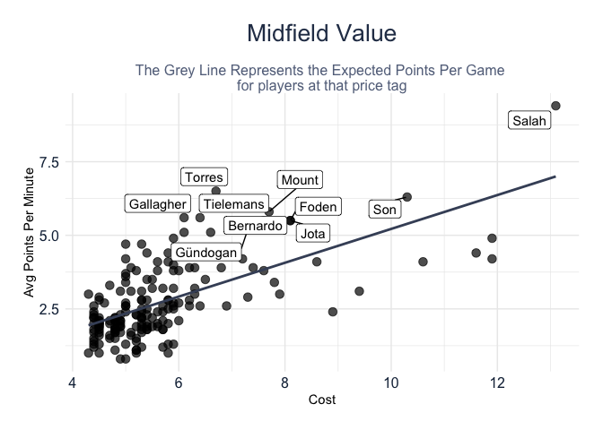
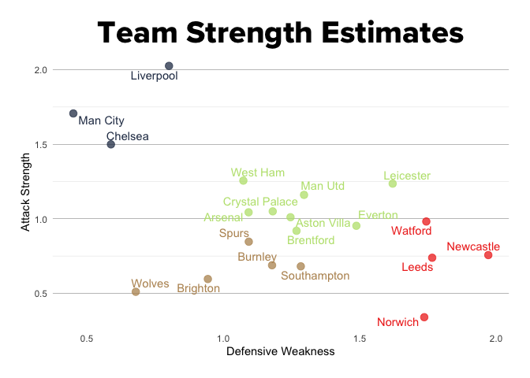

FPL R
================
JFynn
28/7/2018

### Intro

We’re going to use the fplR library to pull FPL data, explore some of
the data to find players who offer good value for points, and then
evaluate some teams and make a prediction on next weeks games.

### Schedule

### Top Players

Viewing the top players based on minutes playes and points accumulated.

<!-- -->

### Goalkeeper

Which goal keeps are performing above an expected level for their price?

<!-- -->

### Defender

<!-- -->

### Midfielder

<!-- -->

### Forward

<!-- -->

### Performance Model

I want to look at expected team performance to select a player. Modeling
players would be more applicable to what we want, but player performance
is highly volatile, team performance is much more consistent.

Its also fair to say that if a player is on a team doing well, and is
playing, they are likely to reap the rewards of that team.

I’m using a dixon coles model to do this. I’ve tried with more common
regression techniques, but this has proven more robust over time.

“Modelling association football scores and inefficiencies in the
football betting market.” Journal of the Royal Statistical Society:
Series C (Applied Statistics) 46, no. 2 (1997): 265-280.

Using the dixon coles model we can evaluate the respect offensive
strengths and defensive weaknesses of a team.

<!-- -->

Next weeks score lines:

| Home Team   | Away Team      | Home Goals | Away Goals | Probability |
|:------------|:---------------|-----------:|-----------:|------------:|
| Norwich     | Arsenal        |          0 |          1 |   0.1870100 |
| Brighton    | Brentford      |          0 |          0 |   0.1586594 |
| Aston Villa | Chelsea        |          0 |          1 |   0.1384416 |
| West Ham    | Southampton    |          2 |          0 |   0.1302350 |
| Spurs       | Crystal Palace |          1 |          1 |   0.1272153 |
| Burnley     | Everton        |          1 |          1 |   0.1267272 |
| Man City    | Leicester      |          3 |          0 |   0.1238130 |
| Newcastle   | Man Utd        |          1 |          2 |   0.0953413 |

<!-- -->
